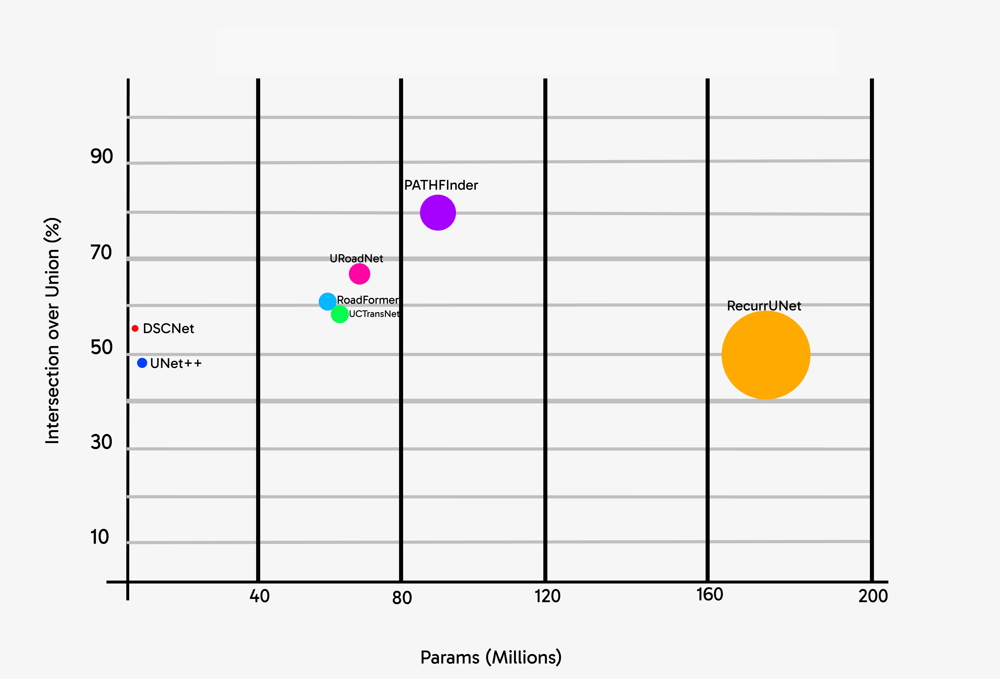

<h1 align="center" id="title">PATHFinder: A Foundation Model for Road Mapping in Support of United Nations Humanitarian Affairs</h1>


This repository contains the official Pytorch implementation of training & evaluation code and the pretrained model for PATHFinder (Paper to be released soon).




<h4 align='center' >Figure 1: Performance of PATHFinder on the DeepGlobe Dataset</h4>


<br/>


PATHFinder  is an efficient road semantic segmentation model, as shown in Figure 1, built on the simple yet powerful [SegFormer](https://arxiv.org/abs/2105.15203).

## Installation

For install and data preparation, please follow the steps mentioned below.


What works for me: ```CUDA 12.7``` and  ```pytorch 2.5.0``` 

```
git clone https://github.com/Oraegbuayomide10/PathFinder.git
cd PATHFinder
pip install -r requirements.txt
```

## Evaluation

Either download `trained weights (mit_b5 and PATHFinder)` manually to a folder named ```weights``` in the root directory:
 [google drive](https://drive.google.com/drive/folders/13hKk38Ib0EepBvHSf3Xon16YsqAUWtlZ)  

OR 

Automatically download `trained weights (mit_b5 and PATHFinder)` using the `download_weights.py` file

#### Using the `download_weights.py` file (this automatically download the models weight to a folder named ```weights```):

1. Download the ```PATHFinder``` pretrained model (PATHFinder or pathfinder is accepted as the name of the model)
   
        python PATHFinder/utils/download_weights.py --model pathfinder


