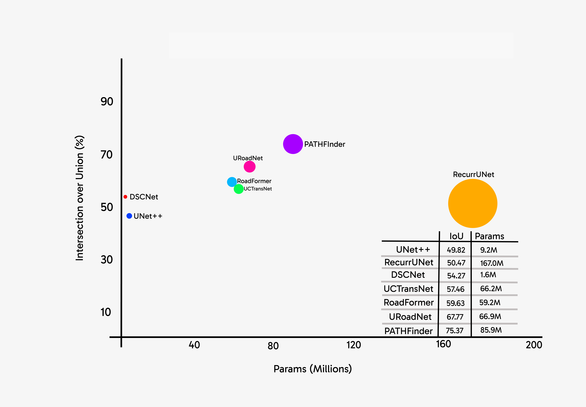
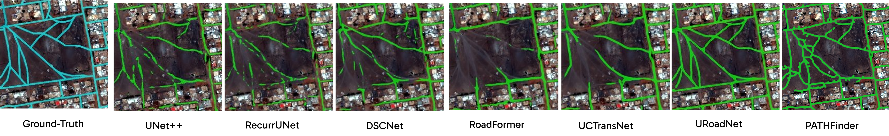
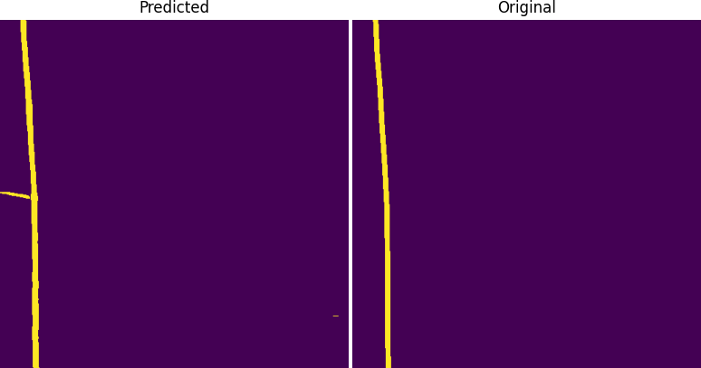
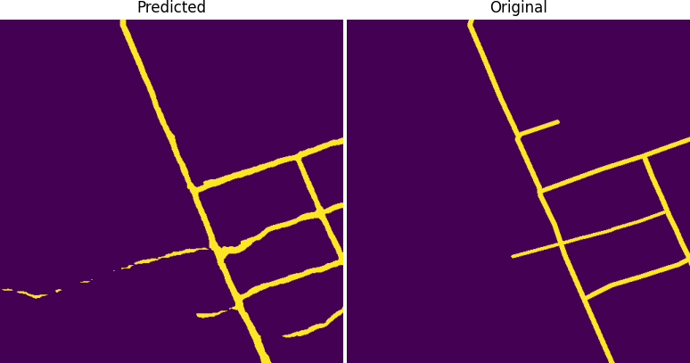

<h2 align="center" id="title">PATHFinder: A Foundation Model for Road Mapping in Support of United Nations Humanitarian Affairs</h2>


This repository contains the official Pytorch implementation of training & evaluation code and the pretrained model for PATHFinder (Paper to be released soon).


<div style='justify-content: center; display:flex; text-align:center'>
        
</div>


<h4 align='left' >Figure 1: Performance of PATHFinder on the DeepGlobe Dataset</h4>

<br/>

<p></p>

<div style='text-align: center'>
 
</div>

<h4 align='center' >Figure 2: Visual Performance of the PATHFinder on the Spacenet Dataset</h4>

<br/>


PATHFinder is an efficient road semantic segmentation model, as shown in Figure 1, built on the simple yet powerful [SegFormer](https://arxiv.org/abs/2105.15203).

## Installation

For install and data preparation, please follow the steps mentioned below.


What works for me: ```CUDA 12.7``` and  ```pytorch 2.5.0``` 

#### 1. Clone Repository
```
git clone https://github.com/Oraegbuayomide10/PathFinder.git
```
#### 2. Move into the directory
```
cd PATHFinder 
```
#### 3. Install dependencies using ```pipenv```
```
pipenv install
```
#### 4. Activate virtual environment using ```pipenv```
```
pipenv shell
```

## Evaluation

Either download manually to a folder named `weights` in the root directory the `PATHFinder trained weights` :
 [google drive link to PATHFinder weights](https://drive.google.com/drive/folders/13hKk38Ib0EepBvHSf3Xon16YsqAUWtlZ)  

OR 

Automatically download `PATHFinder trained weights` using the `download_weights.py` file

#### Using the `download_weights.py` file (this automatically download the models weight to a folder named `weights`):

1. Download the `PATHFinder` pretrained model (PATHFinder or pathfinder is accepted as the name of the model)
   
        python PATHFinder/utils/download_weights.py --model pathfinder


2. Run an Evaluation of the ```PATHFinder``` model on a dataset
   
   A. If using ```Linux bash or macOS terminal```

        python evaluate_model.py \
        --model_checkpoint /path/to/your/checkpoint.pth \
        --images_dir /path/to/images/ \
        --labels_dir /path/to/annotations/ \
        --images_format png/tiff/jpeg \
        --labels_format png/tiff/jpeg 

   B. If using ```Windows```

       python evaluate_model.py `
       --model_checkpoint /path/to/your/checkpoint.pth `
       --images_dir /path/to/images/ `
       --labels_dir /path/to/annotations/ `
       --images_format png/tiff/jpeg `
       --labels_format png/tiff/jpeg 


    #### What works on my Windows PC
       
       python evaluate.py --model_checkpoint weights/pathfinder.pth `
       --images_dir C:/WORKS/Projects/images `
       --labels_dir C:/WORKS/Projects/labels `
       --images_format jpg `
       --labels_format png


### The evaluation process returns a maximum of 5 images of the model's predictions
<div style='jusitfy-content: center; display:flex'>
        
        
</div>
